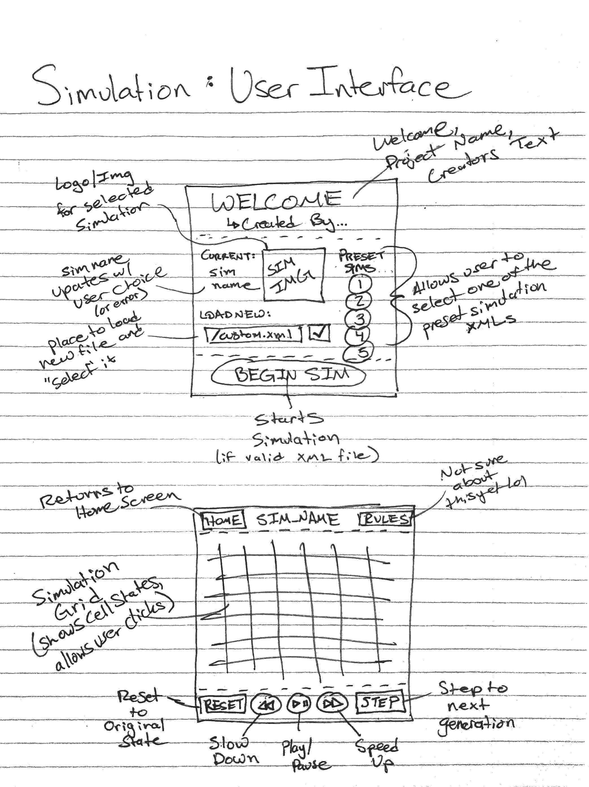

# Simulation Design Plan
### Team 23
### Grant LoPresti, Thomas Owens, Sebastian Williams

## Introduction
This program is being written to simulate an arbitrary cellular automata, which is a grid-based simulation where cells change state based on their current state and the states of their neighbors. The primary design goal of this project is to create a generic controller that can be used to simulate any of a variety of cellular automata, defined by a provided set of rules.

The program is open to extension with new rulesets, which allows it to simulate new cellular automata. However, the simulation's code to load, update and display the automata is closed to modification, meaning every automata will be simulated using the same code and GUI, just with different rules.

## Overview
Our main program will be run from a Simulation class, which will create a Rules object, then create Cell objects with that Rules object and place them in their positions in the grid (in a 2D array). The Simulation will communicate with the GUI as the program runs to recieve user input, and update the appearance as the simulation progresses.

Cell objects will maintain information about their current states, as well as pointers to their neighbors. They will be the only objects that interact with the Rules class.

Rules objects will contain the rules of the automaton, which describe the evolution of a cell based on its state and its neighbors states. A Rules object will be created in the Simulation class with parameters corresponding to the global simulation paramaters. It will also be passed into every Cell created, where a reference to it will be stored. The Cell class will use the Rules class to calculate its new state.

The GUI class will handle all displays and user input, as described in the Basic implementation specification. It will only interact with the Simulation class, and will have no connection whatsoever to the Cell or Rules classes.

## User Interface

The user interface will display the grid of cells. It will have a drop-down menu to select a simulation type (with default, and a file picker to choose a custom XML file with the initial conditions of the selected simulation. It will have buttons to pause, play, step, and change the step rate of the simulation. The GUI will report an XML file with an "Invalid Simulation Type" or "Unexpected Input Data".

## Design Details

For much of the implementation of and interactions between Classes, refer to the UML diagram above. Much of the information given in the UML will not be repeated in this section.

GUI is the class that handles user input and relaying that information to the simulation. The GUI is responsible for registering user input, specifically with the button described by the methods in the UML diagram the GUI class. The GUI is the entry point for the application which means that the GUI will be the one which creates the simulation object. The path selected from the file explorer will be passed to the simulation when it is created. By keeping the GUI seperate from Simulation and Rules, we keep the implementation of the simulation logic hidden from the GUI.

Simulation is the class that handles calculating the next state of the simulation, updating the the simulation, and maintaining the grid. A Simulation is initialized with an XML file as a parameter that holds the initial conditions and simulation type for the simulation. It interprets the initial grid conditions as its 2D array of Cells and creates corresponding Cell objects with pointers to each of their neighbors. It passes other XML parameters to a new Rules object, which handles the simulation's rules. The GUI uses the Simulation class and pulls data from it. The Simulation class should not need to be changed to add any additional features, as it should flexibly handle any simulation.

The Rules class is an abstract class, intended to hold all of the rules for a given simulation. It can be extended to implement any new cellular automata by coding a new ruleset in a new sub-class.

The Cell class holds the state of a cell and pointers to its neighbors. It updates itself using a Rules instance. The Cell class should not need to be changed for any new simulation, except possibly to change the number of neighbors that it considers.

## Design Considerations
The only major design issue remaining is that of the Has-A relationship between Simulation and Rules. This relationship exists because the simulation needs to be the one loading the XML file for the rule properties. There were several proposed ways to fix this. First, it was suggested that Rules not be made abstract so that it could load the XML file itself without needing Simulation. However, making Rules not abstract doesn't make sense as the major information it stores is in the abstract calculateState method. Second, it was suggested that each Cell class load the XML file and pass it to Rules so that Simulation wouldn't have a Has-A relationship with rules. However, this would make Cell more complicated and be responsible for more than what it should be.

 The major assumption that went into the design of this program was that all simulations could be determined by a single rules class with a single calculateState method. We believe this assumption is well founded as the guidelines for the simulation state that each cell's future state only depend on the state of the cell's neighbors. Since we are passing pointers to the cell's neighbors to the calculateState method in the rules object, the Rules object should have enough information to calculate what the future state of the cell should be.

## Use Cases
**Apply rules to a middle cell:**
Cell: state = getState(Cell left, Cell right, Cell up, Cell down) uses logic from a class that extends Rules.

**Apply rules to a edge cell:** 
Cell: state = getState(Cell left, Cell right, Cell up, Cell down) once cell will be NULL but that wont matter within the game rules logic which will be within a class that extends Rules.

**Update all cells in the simulation:**
GUI: 
simulation.step();

Simulation:
* for each Cell:
    * Cell.calculateNewState();
* for each Cell:
    * Cell.updateState();

**Set the value of a configuration variable based on an XML file:**
Simulation: 
Rules ruleinstance = new RulesSubclass("xml_path.xml");

*Begin simulation with new Rules class r*
* for square in grid:
    * square = new Cell(ruleinstance, pointers to neighbors);

**Swich Simulations by loading an XML file**
GUI: 
Simulation.reset();
currentSimulation = new Simulation("Wator.xml");
currentSimulation.play();

## Team Responsibilities

 * Team Member #1 Sebastian - View (GUI class)

 * Team Member #2 Thomas - Model (Rules and Cell class)

 * Team Member #3 Grant - Controller (Simulation)

